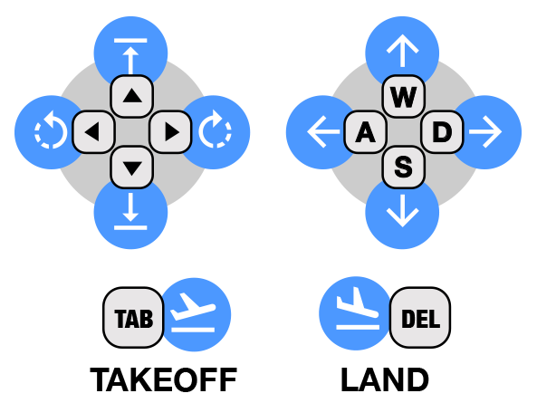

# Keyboard Controls

Use the keyboard to control the drone by selecting the keyboard tab in the sidebar.

W = Forward, A = Left, S = Back, D = Right

Up Arrow = Up, Left Arrow = Yaw left, Down Arrow = Down, Right arrow = Yaw Right

Tab = Takeoff, Delete = Land


These controls can be used in the keyboard tab or the fullscreen menu.


