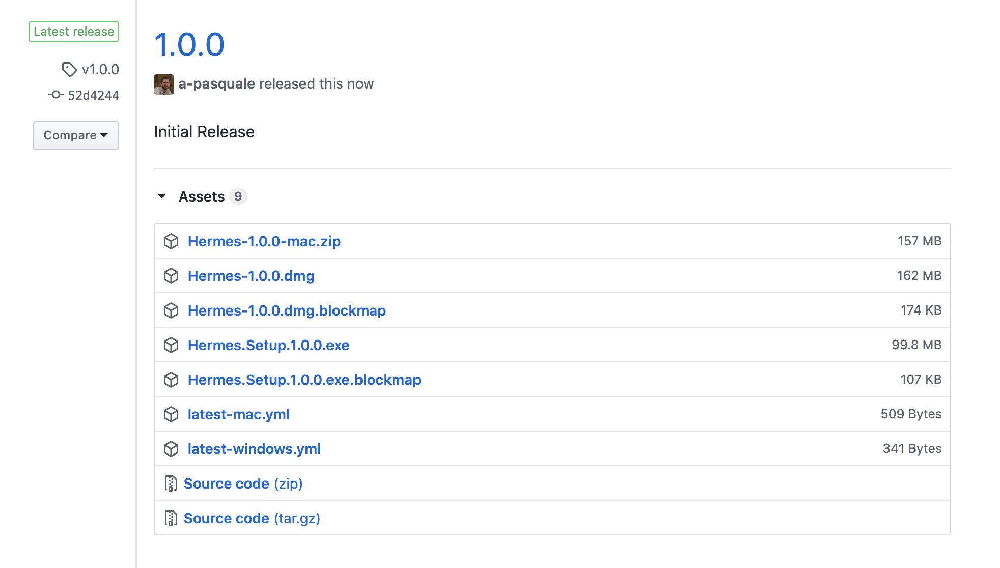

# Installation



Download the .dmg of the newest release from the [releases page](https://github.com/tgb20/Hermes/releases).

Then copy the Hermes program to your Applications folder

And you should be good to start programming and flying your Tello Drone with Hermes!



Download the .exe of the newest release from the [releases page](https://github.com/tgb20/Hermes/releases).

The run the .exe to install Hermes. When it finishes installing it will launch. You may need to configure firewall settings to allow it to connect to the drone.



There are plans to extend the platforms that Hermes is offered on. The current list of candidates is:

* iOS
* Chrome OS
* Android



