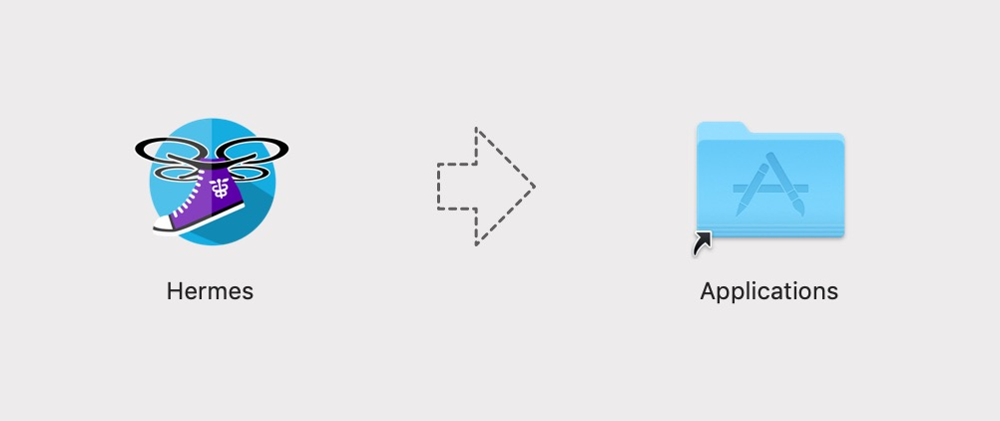

# Installation



Download the .dmg of the newest release from the [releases page](https://github.com/tgb20/Hermes/releases).

Then copy the Hermes program to your Applications folder

And you should be good to start programming and flying your Tello Drone with Hermes!



Unfortunately right now there is not a Windows version of Hermes. This is planned to be implemented in the near future and should be available before the Beta period ends.



Unfortunately right now there is not a Linux version of Hermes. There are not current plans to implement this at this time.



