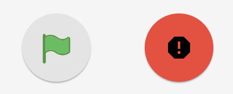

# Running your code

To run your code with Hermes simply build you script and then click the green flag on the programming tab.

Hermes will continue to run your program until it reaches the end, so in the case of an emergency where you need to stop your drone you can click the red emergency stop button to cancel your program execution and turn the motors off.


The emergency stop will terminate all motors, so use caution when using it or the stop motors block.


