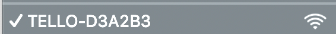

# Running your code

### Connecting to the drone

Before you can run your code you need to be on the same network as your DJI Tello. Right now we only support the base network configuration, but in the future we will be adding in support for swarming modes.

Just simply connect to the network of your drone. By default this will be TELLO- followed by your Tello ID. This may or may not change as you swap out batteries.


If you lose connection to the drone don't worry! Tellos will turn off after a couple minutes of inactivity. Just turn it back on and Hermes should auto reconnect you to the drone.


To run your code with Hermes simply build you script and then click the green flag on the programming tab.

Hermes will continue to run your program until it reaches the end, so in the case of an emergency where you need to stop your drone you can click the red emergency stop button to cancel your program execution and turn the motors off.


The emergency stop will terminate all motors, so use caution when using it or the stop motors block.


