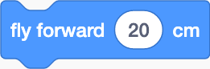
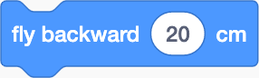
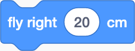
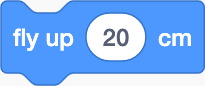
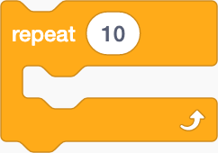
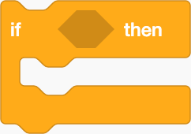

# Block Definitions

## Motion

## Events

## Control

## Sensing

TOF = Distance to ground using just the built in ToF sensor \(height estimation using light\)

## Camera

## Operators

## Variables

