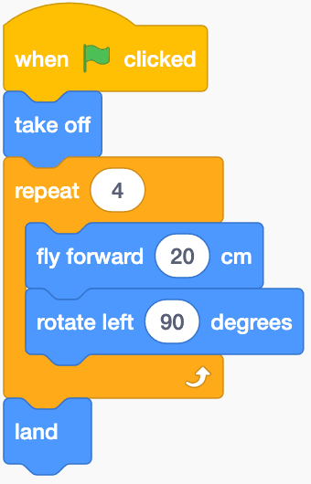

# Working with Scratch Blocks

Scratch is an programming interface that uses blocks as scripts. This are created by stacking multiple blocks under a When Green Flag Clicked Button.

It is possible to have multiple Green Flags in a program, but you should keep in mind that there can be conflicts between instructions. Hermes will try and execute the code in parallel, but the highest block in the workspace will be started first.


Right now you can run code outside of a green flag. This can cause some issues and is not advised. This will be patched out soon.


